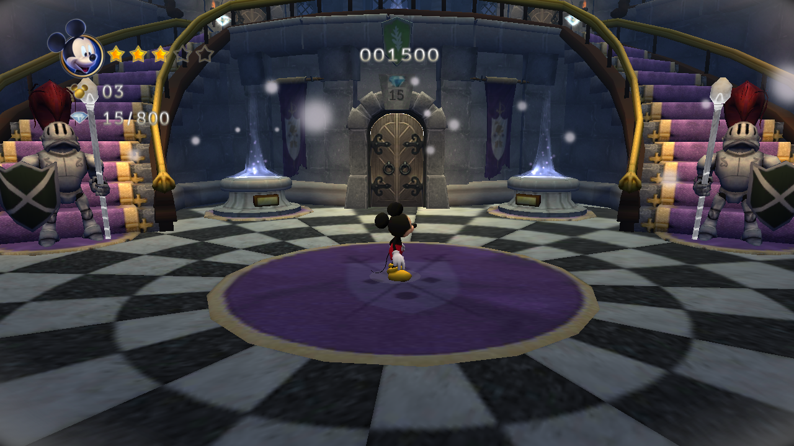

# 🏰🐭 Castle of Illusion — NextOS Android port (Mali-450 / GLES2)

Port so-loader do **Castle of Illusion Starring Mickey Mouse** (Disney/Sega 2013,
engine `oz`, `libViewer_GP.so` arm64, NativeActivity + FMOD Ex + GLES2 puro).

**Estado: JOGÁVEL COMPLETO COM SOM E CORES, ~30fps (cap da engine).**
Gamepad nativo (SDL + GameControllerDB), save/CONTINUE, inglês.

## Game files (BYO — do seu APK/OBB legítimos)
- `libViewer_GP.so` e `libfmodex.so` (de `lib/arm64-v8a/`)
- `obb/main.154.obb` (pack `oz`, lido direto por fopen)

## ⭐ Destaques — as 3 soluções que destravaram o port

### 1. 🖤→🌈 "Mickey preto / porta preta" = npot_fix herdado (wrap CLAMP forçado)
Personagem e objetos dinâmicos renderizavam como silhueta escura com forma
PERFEITA (mundo lightmapped OK). Não era shader, luz, NaN nem GLES3: o
`my_glTexParameteri` herdado do scaffold Dysmantle forçava
`WRAP_S/T=CLAMP_TO_EDGE` em TODA textura — materiais com UV espelhado/repetido
(personagem skinned, portas `*_mirror_*`, plumas) amostravam só a BORDA do
atlas. **Fix: npot_fix default OFF** (religar: `DYSMANTLE_NPOT_FIX=1`).
Cadeia de evidência que fechou a raiz (probes `COI_CHARFS=light|self|amb|tex|texamp`
+ `COI_TEXDUMP=1`): luz total no personagem = branca ✓; payload ETC1 dumpado e
decodificado no host = atlas perfeito ✓; UV float puro ✓ → sobrou o sampler.
⚠️ Lição para QUALQUER port scaffoldado do Dysmantle — ver `AGENTS.md` do repo.

### 2. 🔊 Áudio FMOD Ex = dlclose(handle fake) explodia no ld-linux
`FMOD_OS_Output_GetDefault` SONDA o output: `dlopen("libOpenSLES.so")` (recebe
o handle fake `SL_MAGIC` do nosso shim) e `dlclose` logo em seguida. Repassar o
handle fake pro `dlclose` real do glibc = SIGSEGV (`memcpy(NULL,..,11)` dentro
do ld-linux). **Fix: `my_dlclose` reconhece `SL_MAGIC` e retorna 0.** Com isso o
FMOD inicializa no `opensles_shim` (SDL2 44.1kHz S16, resample por player
24k→44.1k, pump 4ms) — música + SFX funcionando.

### 3. 🏎️ Perf: shaders intactos + mipmaps de volta
Removidos os patches obsoletos `invariant gl_Position` e `sqrt→abs` (default
OFF; religar `COI_INVARIANT=1`/`COI_SQRTABS=1`) — o compilador GP do Mali-450
recebe o shader original. O fim do npot_fix também devolveu MIPMAPS (menos
banda de textura). Medido: 30.7fps cravado no hub, 27-29 em área pesada.

## Fixes anteriores (s1/s2)
- **struct android_app CLÁSSICA** (native_app_glue bionic LP64) — struct estilo
  GameActivity punha `window` no offset errado → engine pulava o render.
- **JNI_OnLoad antes do android_main** (engine guarda o vm em global próprio).
- **isFireTV=true** liga o modo console → keys roteiam pros filtros de gameplay.
- Direções = vetor 8-way canônico via MOTION/JOYSTICK (`ev.x/ev.y`), cardeais
  ±1.0 / diagonais ±0.7 (receita coi_vita/coi_nx); A=96 B=97 X=85 Y=100
  Start=4(pausa) Select=82.

## Scripts no gamedir (device)
- `play.sh` — launcher limpo pra jogar (foreground, som ativo).
- `fast2.sh [COI_CHARFS] [sufixo]` — run de diagnóstico ~90s: martela tap+A+B
  do título até gameplay (save=CONTINUE), tira `shot_<suf>{1,2}.raw`.

## Envs de diagnóstico (todos default OFF)
`COI_CHARFS=light|self|amb|tex|texamp` (visualiza termos de luz/albedo nos
materiais de personagem) · `COI_TEXID=1` (id+formato de todo upload) ·
`COI_TEXDUMP=1` (salva payload ETC1 256×256 lvl0 em `texetc_<id>.bin`) ·
`COI_NOAUDIO=1` (FMOD nosound) · `DYSMANTLE_NPOT_FIX=1` / `COI_INVARIANT=1` /
`COI_SQRTABS=1` (religam os fixes antigos).
